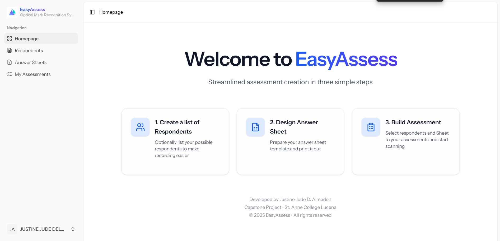
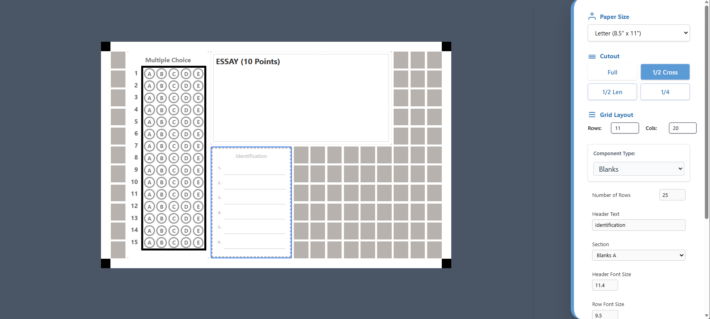
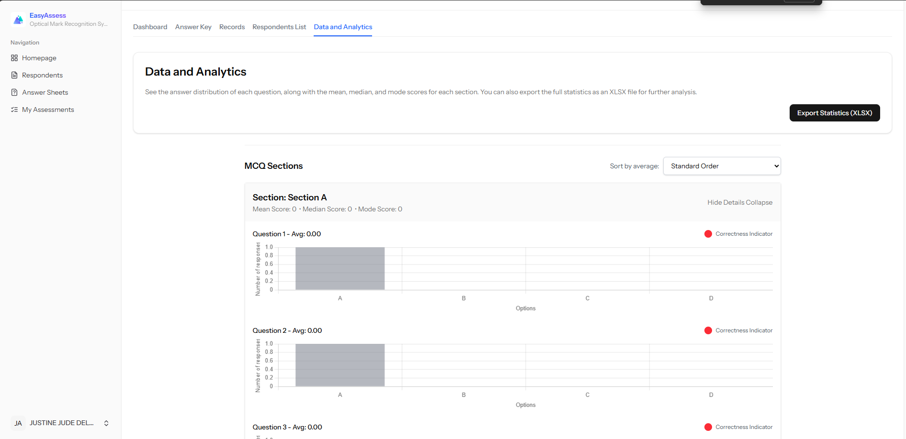
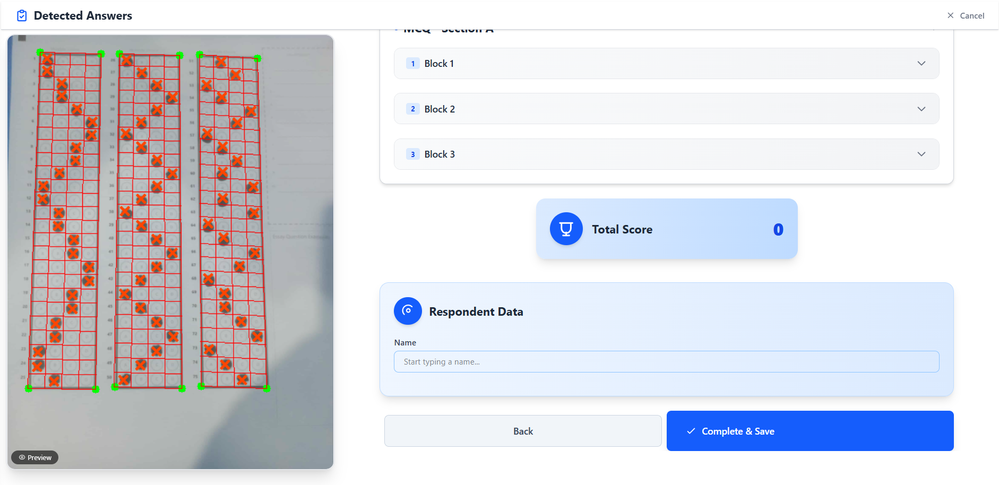
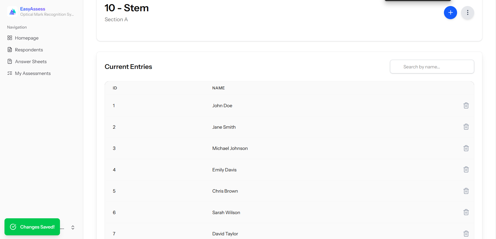

# EasyAssess

**EasyAssess** is a comprehensive web-based platform designed to streamline the creation, management, and grading of assessments. It provides powerful tools for educators and administrators to build dictionaries, design OMR (Optical Mark Recognition) sheets, and conduct effective evaluations.

## 🚀 Key Features

### 📚 Dictionary Management (Lists of Names)
Create and organize lists of names (dictionaries) to easily manage students, participants, or items for your assessments.
- **Simple Management**: Easily add, edit, or remove names from your lists.
- **Access Control**: Share these lists with specific users or teams.

### 📝 OMR Sheet Generator
Design custom OMR sheets tailored to your specific assessments.
- **Visual Editor**: Intuitive tools to create bubble sheets.
- **Customizable**: Adapt layouts for different question types and answer formats.
- **Downloadable**: Export sheets for printing.

### 📊 Assessment & Grading
Conduct assessments and manage results efficiently.
- **Digital & Physical**: Support for both online and printed OMR-based assessments.
- **Answer Keys**: Easy interface to define correct answers.
- **Recording**: Tools to scan or record responses (including OMR processing).
- **Sharing**: Generate unique access codes for easy distribution of assessments.

## 🛠️ Technology Stack

-   **Framework**: [Laravel 12](https://laravel.com/) (PHP)
-   **Frontend**: [Vue.js](https://vuejs.org/) via [Inertia.js](https://inertiajs.com/)
-   **Styling**: [Tailwind CSS](https://tailwindcss.com/)
-   **Database**: SQLite (Default) / MySQL

## 💻 Installation & Setup

1.  **Clone the repository:**
    ```bash
    git clone <repository_url>
    cd EasyAssess
    ```

2.  **Install PHP dependencies:**
    ```bash
    composer install
    ```

3.  **Install Node.js dependencies:**
    ```bash
    npm install
    ```

4.  **Environment Setup:**
    ```bash
    cp .env.example .env
    php artisan key:generate
    ```

5.  **Database Migration:**
    ```bash
    php artisan migrate
    ```

6.  **Run the application:**
    ```bash
    npm run dev
    # In a separate terminal
    php artisan serve
    ```

## 📄 License

This project is open-source and available under the [MIT license](https://opensource.org/licenses/MIT).

## 📸 Screenshots

### Landing Page


### Dashboard


### OMR Sheet Creation


### Data & Analytics



